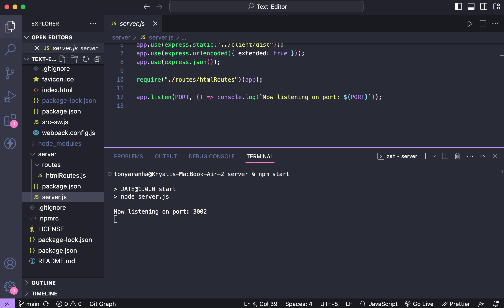
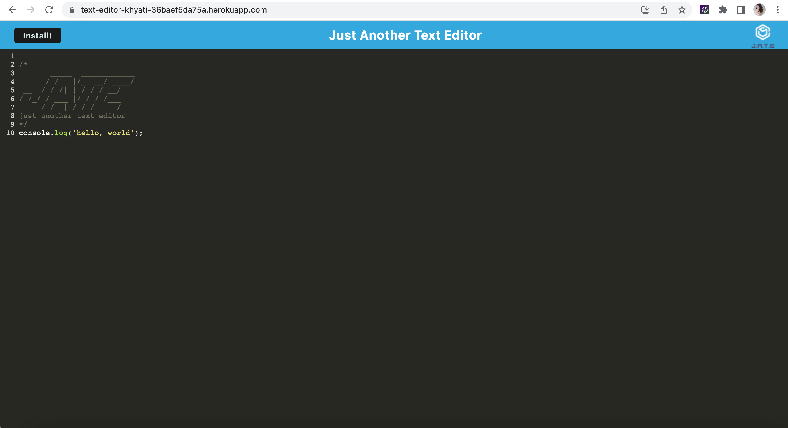
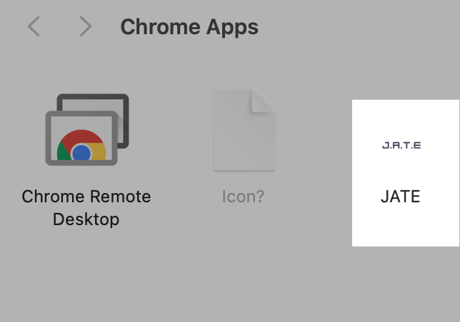
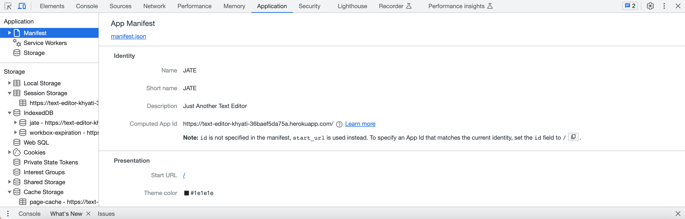

# Text-Editor

## Description

The web text editor application empowers users to create notes or code snippets seamlessly, regardless of their internet connection status. With the integrated service worker and Cache API, the application remains fully functional even offline, ensuring reliable access to saved content. Users can effortlessly retrieve their notes and access previously visited pages, making it a dependable tool for productive work, both online and offline.  

- [Application](#Application)
- [Technologies Used](#TechnologiesUsed)
- [Installation](#Installation)
- [Usage](#usage)
- [Contributing](#Contributing)
- [License](#license)

## Application

Run the [Text-Editor](https://text-editor-khyati-36baef5da75a.herokuapp.com/) application on Heroku
The following photos show how the application looks:

## Technologies Used

- HTML: For structuring the content and user interface of the application.
- CSS: To style and visually enhance the user interface elements.
- JavaScript: To add interactivity and functionality to the text editor.
- Progressive Web App (PWA) criteria: To ensure offline functionality and other PWA features.
- Service Worker: For managing offline caching and providing a reliable experience without an active internet connection.
- Cache API: To store and retrieve data, allowing the application to function smoothly offline.
- IndexedDB: For local database storage to save user-created notes and code snippets.
- Webpack: For bundling and optimizing JavaScript files to enhance performance.
- Heroku: For deploying and hosting the web application on a cloud platform.

## Installation

- This text editor require a number of methods and store data to an IndexedDB database to be builded up.

- This application will require the installation of Node.js and various npm packages.

- Node Package Manager (npm) is a software manager and installer which puts the modules in place so that the node project can utilize it, and also, it manages dependency conflicts intelligently and initialized using **npm init**. The package.json will be generated and will contains all the details of the application in which the user have inputted during the npm initialization.

- This application will use the following npm packages:-

        * npm install express (express.js)
        * npm install --save-dev webpack (Webpack)
        * npm install webpack-dev-server --save-dev (webpack-dev-server)
        * npm install --save-dev webpack-pwa-manifest (WebpackPwaManifest)
        * npm install babel (Babel)
        * npm install --save-dev css-loader (CSS-loader)
        * npm install concurrently --save (run multiple commands concurrently.) (Concurrently)
        * npm npm install idb (IndexedDB)

- The required modules are bundled in the package.json file and at CLI or integrated terminal type in **npm run install**, the modules will be installed.

## Usage

Once the app is running in nodeJS then open http://localhost:3001/ in any browser, and you will have your text editor. You can download the text editor using the install button on top-left and you will be able to access it offline, You can save the data and close the app, once you open the app again you will find your content as you left before.

## Contributing

Contributions are welcome! If you find any issues or have suggestions for improvement, please open an issue or submit a pull request.

- Fork the repository.
- Create a new branch: `git checkout -b feature/your-feature-name`
- Make your changes and commit them: `git commit -m 'Add some feature'`
- Push to the branch: `git push origin feature/your-feature-name`
- Open a pull request.

## License

MIT License.
For more information on the license, please refer to the LICENSE file in the repo
